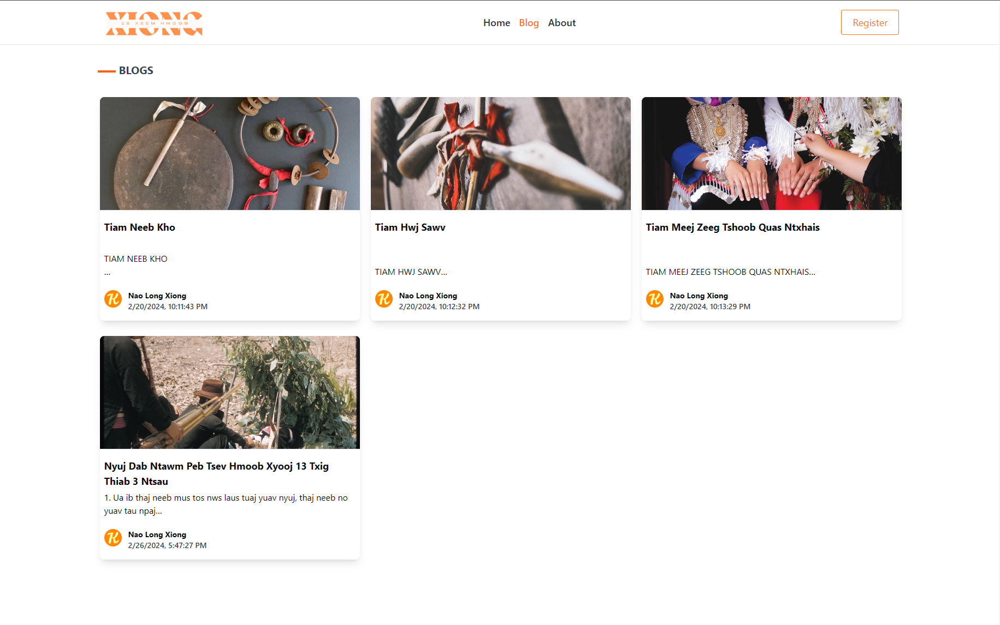

# Xiong Customs 

<p align="center">
  
</p>

## Description
Xiong Customs is a blog platform dedicated to preserving and sharing the rich heritage of our culture. Through engaging articles and stories, we provide insightful information on traditional ceremonies, rituals, and practices, connecting readers with the depth of our ancestral roots in the modern world.

## Screen Shots




 Click on the link deploy application: 
[Xiong Custom](https://xiongcustoms.vercel.app/)


## Table of Contents
1. [Installation](#installation)
2. [Technologies](#technologies)
3. [Usage](#usage)
4. [Contribution](#contribution)
5. [License](#license)
6. [Contact](#contact)

## Installation
Make sure that you have Node.js install, if you do not have node.js, you can visit [Node.js website](https://nodejs.org/en).

You will also need to add dependencies, in your terminal type in:

```
cd server
npm install
npm start
```
then open up a new ternimal window and type in:
```
cd client
npm install
npm start
```


## Technologies

<p align="center">
  
  
  
  
  
  
  
  
  
  


</p>

## Usage

Make sure you have MongoDB Compass. If you do not have MongoDB you can you visit [MongoDB website](https://www.mongodb.com/try/download/community).


## Contribution

Created for the Final project Challenge of the U of M full stack boot camp. Contact me with ideas and request for changes.


## License

This project is licensed under the MIT License.

## Contact

 * Email: xiongxeng@gmail.com
 * Github: http://github.com/freeway9527

